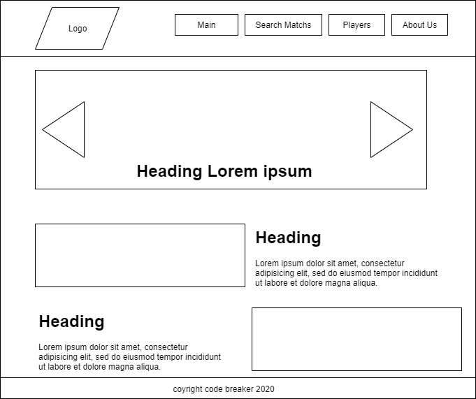
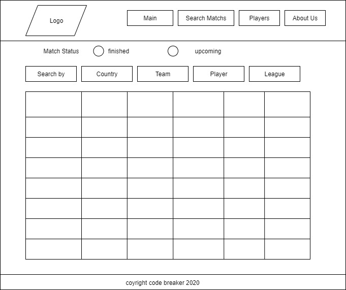
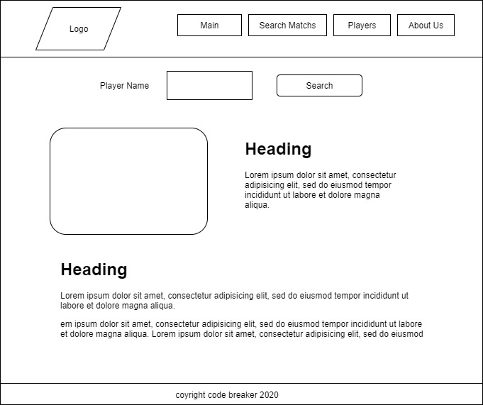
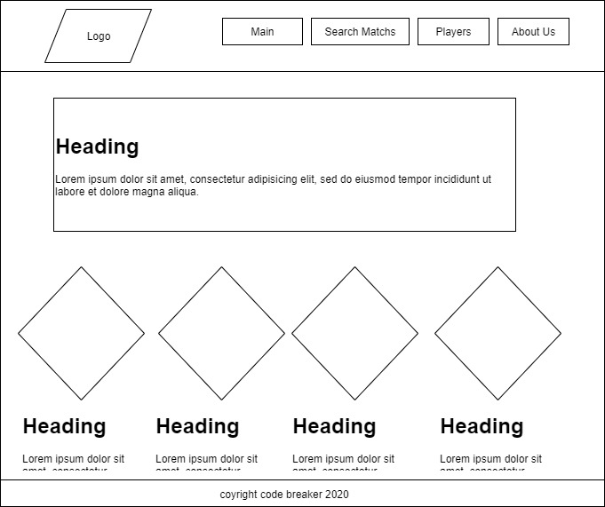
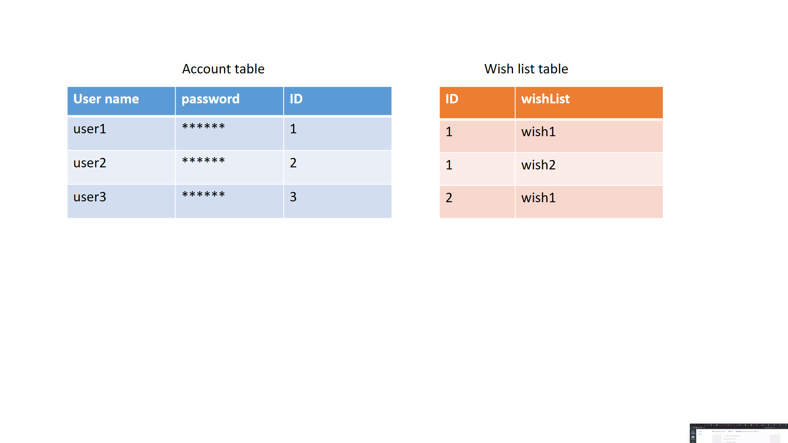

# goalers

## Table of Contents

- [About the Project](#about-the-project)
- [Wireframes](#Wireframes)
- [User Stories](#User-Stories)
- [Domain Modeling](#Domain-Modeling)
- [Contributing](#contributing)
- [License](#license)
- [Contact](#contact)

# About the Project

The main page will display the upcoming football matches
The user can search for cities and get football matches within it and the website will provide the weather state for that city to help user deciding whether to attend that match or not.
User can also Search for matches using team name or player name
User can search for matches that a certain player was in.
User can create an account to be able add matches that he wants to append to wish list.
There will be a page that contains videos about best goals.
Stretch goal: add link for live view for matches if exists

**MVP** : 
the minimum requirements for the website is to display football matches when user search about them. And to display football news on main page.
There will be a page leagues names and what teams are involved in it. And user can display more information about each football team.

# Wireframes

- Home Page

- search-matches

- player information page

- about us page

# User Stories

1. As a user, I would like to view highlights videos about soccer

- **Feature Tasks**:
 - Create a slider that contains images about football matches highlights
 - use an api to render images and more informations about each highlight. the informations includes :
  - image about the highlight video
  - the teams in each video  
- when user click on the button under the image a video will be shown.

- **Acceptance Tests**:
 - Ensure that you each slide is connected to a video
 - Ensure that user can move from video to another
 - Ensure that the content is updated frequently

2. As a user, I would like to search for matches

- **Feature Tasks**:
 - a page with a form with multiple ways of searching
 - display results with images.
 - a lot of usefull informations will be displayed
 - when searching about matches by cities weather for that city will be provided
 - display teams in the match with the corresponding team flag

- **Acceptance Tests**:
 - Ensure that search results are correct and relevant to the input.

3. As a user, I would like to read the latest news in the sport world.

- **Feature Tasks**:
 - *Hompe page:*
  - display sport news in organised way to make them attractive and easy on the eye
  - display image for each news section
  - news will be updated frequently

- **Acceptance Tests**:
 - Ensure that the news are relevant to sports and updated.

4. As user, I would like to add matches to my wish-list

- **Feature Tasks**:
 - add data base to save the matches that user choose
 - allow user to sighn up in the website to have customised data
 - when page loads data will be retrieved from data base to the local storage to maintain the login

- **Acceptance Tests**:
 - Ensure the data base is working and connected to the server
 - ensures that user can add information to the data base
 - Ensure that the website will not require logging-in at each page using local storage

 5.	As user, I would like to search for a certain player and read his cv and other information about him.

 - **Feature Tasks**:
  - Create a page that displays information about player
  - implement a search form to let the user input the player name and search
  - the result will include an image of the player along his personal data.

- **Acceptance Tests**:
  - ensures that the results are relevant to the input

# data base modeling

# Domain Modeling

# Contribution :

- [Ashjan Albarqi](https://github.com/AAlbarqi)
- [Ahmad Alhrthani](https://github.com/AhmadHirthani)
- [Mohammad Samara](https://github.com/mohammad-samara)
- [Raghad Anees](https://github.com/raghadanees)

# License

Distributed under the MIT License. See [LICENSE](https://www.mit.edu/~amini/LICENSE.md) for more information.
